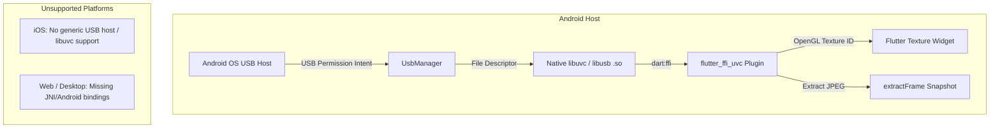
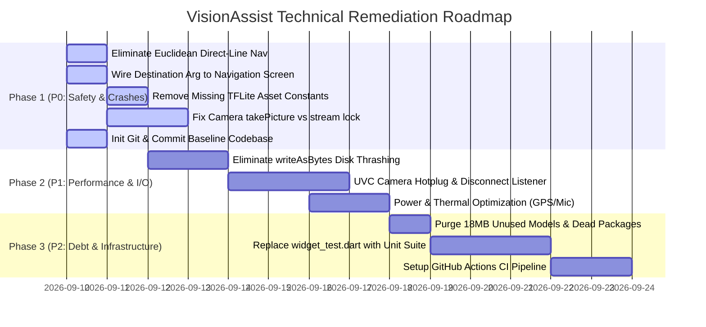

# Technical Concerns, Vulnerabilities, & Technical Debt Analysis

**Project**: VisionAssist / Smart Glasses for Visually Impaired  
**Date of Audit**: September 2026  
**Scope**: Entire Flutter codebase (`lib/`, `android/`, `assets/`, `test/`, configuration, and repository status)

---

## Executive Summary & Risk Assessment Matrix

This audit assesses the technical stability, safety, hardware compatibility, and architectural health of the VisionAssist smart glasses assistive technology application. Because this application serves visually impaired and blind users navigating physical environments, software bugs and latency carry direct safety implications.

### Risk Summary Table

| Severity | Category | Issue Summary | Impact |
|:---|:---|:---|:---|
| 🔴 **CRITICAL** | Safety / Navigation | Direct line navigation fallback ("as the crow flies") when routing fails | May guide blind users into walls, traffic, or hazards |
| 🔴 **CRITICAL** | Assets / Runtime | Missing `currency_classifier.tflite` file referenced in `AppConstants` | Fatal runtime crash if loaded via `TFLiteService` |
| 🔴 **CRITICAL** | Configuration | Hardcoded placeholder Google Maps API key (`YOUR_GOOGLE_MAPS_API_KEY_HERE`) | All fallback directions requests fail with HTTP 400/403 |
| 🔴 **CRITICAL** | DevOps / SCM | Entire repository lacks Git version control (no `.git` directory) | Zero change history, branch management, or disaster recovery |
| 🟠 **HIGH** | Performance | File disk write (`writeAsBytes`) on every camera frame for ML Kit | Heavy flash storage wear, disk I/O bottleneck, frame drops |
| 🟠 **HIGH** | Hardware / Native | Android-only `flutter_ffi_uvc` without USB hotplug/disconnect handling | Native crash or permanent freeze on cable wiggle or disconnect |
| 🟠 **HIGH** | Battery / Thermals | Continuous camera + ML Kit + STT mic + GPS + Wakelock + Compass | Rapid battery drain (<60-90 min), thermal throttling |
| 🟠 **HIGH** | Feature Disconnect | Voice Assistant extracts destination argument but drops it on navigation | Hands-free destination navigation fails silently |
| 🟡 **MEDIUM** | Performance / Dead Code | ~18MB unused TFLite models (`efficientdet`, `ssd_mobilenet`) bundled | Bloats APK package size unnecessarily |
| 🟡 **MEDIUM** | Dependencies | Phantom unused dependencies (`google_maps_flutter`, `google_mlkit_object_detection`) | Increases compile times, dependency conflicts, attack surface |
| 🟡 **MEDIUM** | Security | Client-side API keys via `--dart-define` can be decompiled from APK | API quota theft and unauthorized usage |
| 🟡 **MEDIUM** | Testing / QA | Zero unit/integration tests; single test is an outdated counter template | No regression protection during refactoring |

---

## 1. Critical Issues & Active Bugs

### 1.1 Missing Currency TFLite Model (`currency_classifier.tflite`)
- **Location**: [`lib/core/constants.dart:4`](file:///c:/Users/admin/OneDrive/Desktop/Glasses%20for%20blind%20by%20anity/lib/core/constants.dart#L4)
- **Code Reference**:
  ```dart
  static const String currencyModel = 'assets/models/currency_classifier.tflite';
  ```
- **Observed Asset Tree**:
  - `assets/models/efficientdet-lite0.tflite` (13.8 MB)
  - `assets/models/ssd_mobilenet.tflite` (4.18 MB)
  - `assets/models/.gitkeep`
- **Root Cause**: While `CurrencyService` ([`lib/services/currency_service.dart`](file:///c:/Users/admin/OneDrive/Desktop/Glasses%20for%20blind%20by%20anity/lib/services/currency_service.dart)) was refactored to use Latin script OCR (`google_mlkit_text_recognition`) to parse banknote denominations (10, 20, 50, 100, 200, 500), `AppConstants.currencyModel` and `AppConstants.currencyModelInputSize` remain defined in constants.
- **Risk & Impact**: Any code path calling `TFLiteService.loadModel('currency', AppConstants.currencyModel)` will immediately trigger an unhandled `FlutterError: Unable to load asset: assets/models/currency_classifier.tflite`, causing an instant crash.

---

### 1.2 Bogus Google Maps API Key & Broken Navigation Fallback
- **Location**: [`lib/core/constants.dart:18`](file:///c:/Users/admin/OneDrive/Desktop/Glasses%20for%20blind%20by%20anity/lib/core/constants.dart#L18), [`lib/services/navigation_service.dart:150-176`](file:///c:/Users/admin/OneDrive/Desktop/Glasses%20for%20blind%20by%20anity/lib/services/navigation_service.dart#L150-L176)
- **Code Reference**:
  ```dart
  // lib/core/constants.dart:18
  static const String googleMapsApiKey = 'YOUR_GOOGLE_MAPS_API_KEY_HERE';

  // lib/services/navigation_service.dart:150
  if (_apiKey.isNotEmpty) {
    try {
      final url = Uri.parse(
        'https://maps.googleapis.com/maps/api/directions/json'
        '?origin=$originLat,$originLng'
        '&destination=$destLat,$destLng'
        '&mode=walking'
        '&key=$_apiKey',
      );
      final response = await http.get(url);
      ...
  ```
- **Root Cause**: Because `_apiKey` is populated with the non-empty string `'YOUR_GOOGLE_MAPS_API_KEY_HERE'`, the condition `if (_apiKey.isNotEmpty)` evaluates to `true`. When the primary free routing engine (OSRM) encounters a timeout or network glitch, the service immediately calls Google Directions API using the bogus placeholder key.
- **Impact**: Google returns HTTP 400/403 with `REQUEST_DENIED: The provided API key is invalid`. This triggers unnecessary outbound HTTP requests and delays navigation routing.

---

### 1.3 Hazardous Direct-Line Navigation Fallback for Blind Users
- **Location**: [`lib/services/navigation_service.dart:178-198`](file:///c:/Users/admin/OneDrive/Desktop/Glasses%20for%20blind%20by%20anity/lib/services/navigation_service.dart#L178-L198)
- **Code Reference**:
  ```dart
  // Fallback: Direct Line Navigation Step
  final directDistance = _haversineDistance(originLat, originLng, destLat, destLng);
  _routeCoordinates = [
    LatLng(originLat, originLng),
    LatLng(destLat, destLng),
  ];
  _currentRoute = [
    NavigationStep(
      instruction: 'Walk towards your destination for ${directDistance.toInt()} meters',
      distanceMeters: directDistance,
      durationSeconds: directDistance / 1.2,
      maneuver: 'straight',
      startLat: originLat,
      startLng: originLng,
      endLat: destLat,
      endLng: destLng,
    )
  ];
  ```
- **Physical Safety Hazard**: When both OSRM and Google Directions fail (e.g. offline, bad network, or OSRM demo downtime), the app defaults to a straight euclidean line ("as the crow flies") and instructs the user: *"Walk towards your destination for X meters"*. A visually impaired user relying on voice guidance may walk straight into obstacles, construction ditches, fences, bodies of water, or oncoming vehicular traffic.
- **Remediation**: An assistive app must **NEVER** instruct a blind user to walk along an unverified straight line. If routing fails, the system must announce: *"Walking route unavailable. Please check your internet connection or seek sighted assistance."*

---

### 1.4 Dropped Destination Argument in Voice Navigation Routing
- **Location**: [`lib/providers/voice_assistant_providers.dart:191-194`](file:///c:/Users/admin/OneDrive/Desktop/Glasses%20for%20blind%20by%20anity/lib/providers/voice_assistant_providers.dart#L191-L194)
- **Code Reference**:
  ```dart
  case VoiceCommandType.openNavigation:
    _globalNavigate(const NavigateModeScreen(), 'Opening Navigation Mode');
    break;
  ```
- **Root Cause**: In `VoiceAssistantService.parseCommand` and `GeminiAssistantService.processUserSpeech`, spoken destinations like *"Navigate to pharmacy"* or *"Take me to metro station"* are extracted and stored in `cmd.argument` or `geminiResp.argument`. However, `_executeCommandGlobally` simply instantiates `const NavigateModeScreen()` with no arguments, and never calls `ref.read(navigationStateProvider.notifier).startNavigation(cmd.argument!)`.
- **Impact**: The blind user expects the glasses to begin walking guidance to their requested target, but the app only lands on the map screen with an empty destination field, requiring sight to operate.

---

### 1.5 Dead `useCloudGemini` Parameter in Object Detection
- **Location**: [`lib/services/object_detection_service.dart:146-222`](file:///c:/Users/admin/OneDrive/Desktop/Glasses%20for%20blind%20by%20anity/lib/services/object_detection_service.dart#L146-L222), [`lib/ui/detect_mode_screen.dart:122-126`](file:///c:/Users/admin/OneDrive/Desktop/Glasses%20for%20blind%20by%20anity/lib/ui/detect_mode_screen.dart#L122-L126)
- **Code Reference**:
  ```dart
  // lib/ui/detect_mode_screen.dart:123
  onTap: () async {
    HapticFeedback.heavyImpact();
    ref.read(ttsStateProvider.notifier).speak('Analyzing object with Gemini...');
    await _captureAndDetect(forceSpeak: true, useCloudGemini: true);
  },

  // lib/services/object_detection_service.dart:146
  Future<List<DetectionResult>> processImageBytes(Uint8List jpegBytes, {bool useCloudGemini = false}) async {
    // Parameter useCloudGemini is NEVER referenced in the method body!
  ```
- **Impact**: When the user taps the screen to trigger "Gemini Vision analysis", the TTS announces *"Analyzing object with Gemini..."*, but the method executes the standard local Google ML Kit `ImageLabeler` rather than invoking Gemini Vision. The user receives mismatched feedback.

---

### 1.6 Race Condition: `takePicture()` During `startImageStream()`
- **Location**: [`lib/services/camera_service.dart:76-85, 93-101`](file:///c:/Users/admin/OneDrive/Desktop/Glasses%20for%20blind%20by%20anity/lib/services/camera_service.dart#L76-L101), [`lib/ui/currency_mode_screen.dart:39-43`](file:///c:/Users/admin/OneDrive/Desktop/Glasses%20for%20blind%20by%20anity/lib/ui/currency_mode_screen.dart#L39-L43), [`lib/ui/read_mode_screen.dart:59-63`](file:///c:/Users/admin/OneDrive/Desktop/Glasses%20for%20blind%20by%20anity/lib/ui/read_mode_screen.dart#L59-L63)
- **Root Cause**: On the native phone camera, `NativeCameraSource.initialize()` starts continuous image streaming via `_controller.startImageStream(...)`. Concurrently, the UI screens run a periodic timer (every 3000ms / 3500ms) that calls `extractFrame()`, which invokes `_controller.takePicture()`.
- **Known Flutter Bug**: In the official Flutter `camera` plugin on Android/iOS, invoking `takePicture()` while `startImageStream()` is active is an illegal concurrent state. On many OEM Android devices, it throws a `CameraException(Previous capture has not returned yet.)` or locks up the camera hardware pipeline.

---

## 2. Hardware & Platform Limitations

### 2.1 External USB UVC Camera (`flutter_ffi_uvc`) Limitations
The external smart glasses utilize a Sony IMX378 12MP sensor connected via USB Type-C using the Universal Video Class (UVC) protocol, driven by the `flutter_ffi_uvc: ^0.11.0` package.



#### Key Technical Limitations:
1. **Platform Lock-In (Android Only)**:
   `flutter_ffi_uvc` relies on Android-specific USB file descriptor passing via JNI (`android.hardware.usb.UsbDeviceConnection`). It cannot function on iOS (Apple prohibits low-level USB video class enumeration without MFi/DriverKit), macOS, Windows, or Web.
2. **Missing USB Hotplug / Disconnect Listener**:
   [`lib/services/camera_service.dart`](file:///c:/Users/admin/OneDrive/Desktop/Glasses%20for%20blind%20by%20anity/lib/services/camera_service.dart) only checks `hasUsbCameraAttached()` once during initial boot. If the user plugs in the glasses after starting the app, or if the USB-C cable disconnects while walking:
   - The app does not detect the attachment/detachment.
   - Any subsequent call to `uvcCamera.takePicture()` or texture rendering fails with silent black frames or a native SIGSEGV crash.
3. **Empty `frameStream` in `UvcCameraSource`**:
   [`UvcCameraSource`](file:///c:/Users/admin/OneDrive/Desktop/Glasses%20for%20blind%20by%20anity/lib/services/camera_service.dart#L123) exposes `Stream<CameraImage> get frameStream => _frameStreamController.stream`, but **never** pushes any frames into `_frameStreamController`. As a result, any screen relying on `cameraFrameStreamProvider` (such as `CurrencyModeScreen` and `ReadModeScreen` fallback listeners) receives zero stream events when the USB glasses are connected.
4. **Android USB Permission UX**:
   Android enforces a system dialog: *"Allow VisionAssist to access USB Camera?"* with a checkbox *"Always open VisionAssist when USB device is connected"*. Blind users cannot see or approve this dialog without sighted assistance or an automated TalkBack gesture.

---

### 2.2 Battery Drain & Thermal Throttling
The application continuously runs the following power-hungry hardware subsystems simultaneously:
- **Display**: OLED/LCD panel kept at 100% wakefulness via `WakelockPlus.enable()`.
- **Camera**: 1080p/4K 30fps USB UVC stream or native 1080p sensor.
- **Microphone**: Speech-to-text listening continuously with a 350ms restart loop in [`_restartContinuousListeningIfNeeded()`](file:///c:/Users/admin/OneDrive/Desktop/Glasses%20for%20blind%20by%20anity/lib/services/voice_assistant_service.dart#L92-L100).
- **Location Subsystem**: High-accuracy GPS with `distanceFilter: 2` meters in [`LocationService.startTracking()`](file:///c:/Users/admin/OneDrive/Desktop/Glasses%20for%20blind%20by%20anity/lib/services/location_service.dart#L58-L61).
- **Sensors**: Continuous hardware compass streaming (`flutter_compass`).
- **Processing**: Periodic ML Kit OCR / Image Labeling inferences.

**Estimated Battery Life**: Under continuous operation on a standard 4500mAh Android smartphone, the device will experience severe thermal throttling within 20–30 minutes, and complete battery depletion in approximately 60–90 minutes.

---

## 3. Security & API Keys

### 3.1 Hardcoded Keys & Compile-Time Deficiencies
- **Google Maps Directions Key**:
  Hardcoded as a plaintext placeholder string in [`AppConstants.googleMapsApiKey`](file:///c:/Users/admin/OneDrive/Desktop/Glasses%20for%20blind%20by%20anity/lib/core/constants.dart#L18). If replaced with a real key in source code, it would be checked into version control and embedded into client APK binaries.
- **Gemini AI Key**:
  Loaded via:
  ```dart
  static const String geminiApiKey = String.fromEnvironment(
    'GEMINI_API_KEY',
    defaultValue: '',
  );
  ```
  While `--dart-define=GEMINI_API_KEY=xxx` prevents checking secrets into Git, Dart defines are compiled directly into the binary's `libapp.so` data segment. Any third party using `strings libapp.so | grep AIza` can extract the Gemini API key in seconds.
- **Absence of Backend Proxy**:
  Client-side Gemini API calls expose developer quotas directly to the public. If an attacker decompiles the key, they can exhaust the developer's Gemini quota or run up high API billing charges.

---

### 3.2 Network Dependency & Offline Degradation
The app aims to be a vital mobility tool, yet key components degrade or fail when offline:

| Feature | Online Behavior | Offline Behavior | Severity |
|:---|:---|:---|:---|
| **Voice Assistant Understanding** | Gemini natural language intent parsing | Falls back to keyword regex (`_offlineSemanticClassify`) | ✅ Acceptable |
| **Speech-to-Text (STT)** | Google Cloud STT dictation | Fails unless user has downloaded offline language pack in Android OS settings | 🔴 Critical |
| **Multimodal Scene ("What am I looking at?")** | Gemini Vision descriptive narrative | Hardcoded string: *"Looking ahead, there is an open space..."* regardless of actual scene | 🟠 High |
| **Walking Directions** | OSRM / Google Directions API | Fallback 3: Euclidean straight line vector across buildings | 🔴 Critical |
| **Geocoding & "Where Am I"** | OpenStreetMap Nominatim reverse geocoding | Returns raw latitude and longitude numbers (useless to blind user) | 🟠 High |

---

### 3.3 Nominatim & OSRM Public Demo Server Abuse
- **Nominatim Usage Policy**:
  The reverse geocoding URL [`https://nominatim.openstreetmap.org/reverse`](file:///c:/Users/admin/OneDrive/Desktop/Glasses%20for%20blind%20by%20anity/lib/services/navigation_service.dart#L31) and search URL are free OpenStreetMap servers. Their usage policy explicitly mandates:
  - Maximum 1 request per second.
  - Identification via a valid contact email in the `User-Agent`.
  - No continuous GPS tracking reverse geocoding.
  VisionAssist uses the generic User-Agent `'SmartGlassesAssistiveApp/1.0'` without an email. Nominatim will block IP addresses making frequent requests from client apps.
- **OSRM Demo Server**:
  [`https://router.project-osrm.org/`](file:///c:/Users/admin/OneDrive/Desktop/Glasses%20for%20blind%20by%20anity/lib/services/navigation_service.dart#L88) is an unmonitored demonstration server without SLA. If it goes down or throttles traffic, routing fails.

---

## 4. Performance & Concurrency Bottlenecks

### 4.1 Flash Storage Thrashing via `writeAsBytes` on Every Frame
In all three visual ML services ([`ObjectDetectionService`](file:///c:/Users/admin/OneDrive/Desktop/Glasses%20for%20blind%20by%20anity/lib/services/object_detection_service.dart#L151-L157), [`CurrencyService`](file:///c:/Users/admin/OneDrive/Desktop/Glasses%20for%20blind%20by%20anity/lib/services/currency_service.dart#L27-L33), [`OcrService`](file:///c:/Users/admin/OneDrive/Desktop/Glasses%20for%20blind%20by%20anity/lib/services/ocr_service.dart#L25-L31)), high-resolution JPEG frames (12MP or 1080p, ~200KB to 1.5MB per frame) are written to device flash memory on **every inference**:

```dart
if (_cachedFramePath == null) {
  final tempDir = await getTemporaryDirectory();
  _cachedFramePath = '${tempDir.path}/live_detect_frame.jpg';
}
final file = File(_cachedFramePath!);
await file.writeAsBytes(jpegBytes, flush: false);

final inputImage = InputImage.fromFilePath(file.path);
final labels = await _imageLabeler.processImage(inputImage);
```

#### Why This Is a Major Bottleneck:
1. **Flash Disk Wear**: Writing 1MB every 3 seconds amounts to ~1.2 GB of disk writes per hour of walking.
2. **I/O Latency**: Flash storage write speed fluctuates when the OS performs garbage collection, causing UI thread stutters.
3. **Correct Alternative**: `InputImage.fromBytes(...)` or native bitmap passing directly in memory without touching file storage.

---

### 4.2 Main Thread ML Inference & UI Jitter
- ML Kit inference calls (`_imageLabeler.processImage`, `_textRecognizer.processImage`) are dispatched via platform channels.
- However, image format conversion, byte copying, and JSON parsing occur directly on the root Flutter UI isolate.
- In [`lib/core/utils/image_utils.dart`](file:///c:/Users/admin/OneDrive/Desktop/Glasses%20for%20blind%20by%20anity/lib/core/utils/image_utils.dart#L9-L39), nested pixel manipulation loops (`for (int y = 0; y < height; y++) for (int x = 0; x < width; x++)`) are written in unoptimized Dart without background isolates. If ever invoked on full-frame camera buffers, this would freeze the UI for 200–600ms per frame.

---

## 5. Technical Debt & Missing Infrastructure

### 5.1 Absence of Git Version Control
- **Audit Finding**: Running `git status` in the project root produces:
  ```
  fatal: not a git repository (or any of the parent directories): .git
  ```
- **Analysis**: Although a `.gitignore` file exists, the codebase has never had `git init` executed, or the `.git` directory was removed during file transfers.
- **Risk**:
  - No version history, rollback capability, or commit logs.
  - Collaborative development, automated CI builds, and bisect debugging are impossible until a Git repository is initialized.

---

### 5.2 Broken & Outdated Test Suite
- **Current State**: The repository contains exactly one test file: [`test/widget_test.dart`](file:///c:/Users/admin/OneDrive/Desktop/Glasses%20for%20blind%20by%20anity/test/widget_test.dart).
- **Code Inspection**:
  ```dart
  testWidgets('SmartGlassesApp smoke test', (WidgetTester tester) async {
    await tester.pumpWidget(const SmartGlassesApp());
    expect(find.text('0'), findsOneWidget); // Expects counter '0'
    await tester.tap(find.byIcon(Icons.add)); // Taps '+' icon
    expect(find.text('1'), findsOneWidget); // Expects counter '1'
  });
  ```
- **Evaluation**: This is the default Flutter starter counter test. `SmartGlassesApp` does not have a counter or `Icons.add`. Executing `flutter test` fails immediately.
- **Coverage**:
  - Unit tests for services: **0%**
  - Widget tests for screens: **0%**
  - Riverpod provider unit tests: **0%**

---

### 5.3 Phantom / Bloated Dependencies & Asset Dead Weight
The project includes several unused packages in [`pubspec.yaml`](file:///c:/Users/admin/OneDrive/Desktop/Glasses%20for%20blind%20by%20anity/pubspec.yaml) and bundled assets that are never referenced:

| Dependency / Asset | Size / Overhead | Code Status | Action Needed |
|:---|:---|:---|:---|
| `assets/models/efficientdet-lite0.tflite` | **13.8 MB** | Never referenced anywhere in `lib/` | Remove from assets |
| `assets/models/ssd_mobilenet.tflite` | **4.2 MB** | Only referenced as constant string; never loaded | Remove from assets |
| `google_maps_flutter: ^2.17.0` | Heavy native Google Play Services SDK | Zero imports in `lib/`; app uses `flutter_map` | Remove from `pubspec.yaml` |
| `google_mlkit_object_detection: ^0.15.1` | Heavy native C++ ML Kit model binaries | Zero imports; app uses `google_mlkit_image_labeling` | Remove from `pubspec.yaml` |
| `tflite_flutter: ^0.12.1` | Native TensorFlow Lite runtime binaries | Orphaned in `tflite_service.dart`; never used | Remove or implement |
| `lib/core/utils/image_utils.dart` | 90 lines of unoptimized code | Never imported or used across entire project | Remove or refactor into isolate |

*Total package bloat reducible: ~18MB in assets + several MBs in unused native C++ shared libraries.*

---

### 5.4 CI/CD Absence
- No `.github/workflows/`, `.gitlab-ci.yml`, or Bitbucket pipelines exist.
- No automated linting, static analysis, unit test runs, or Android APK build verification.

---

## 6. Prioritized Remediation Roadmap



### Phase 1: Critical Fixes & Safety Patches (P0 - Immediate)
1. **Safety: Terminate Euclidean Navigation Fallback**:
   In [`lib/services/navigation_service.dart`](file:///c:/Users/admin/OneDrive/Desktop/Glasses%20for%20blind%20by%20anity/lib/services/navigation_service.dart), delete the straight-line fallback. Return an informative error message: *"Route calculation failed. Please check internet connection."*
2. **Connect Voice Destination to Navigation Screen**:
   Update `_executeCommandGlobally` in [`lib/providers/voice_assistant_providers.dart`](file:///c:/Users/admin/OneDrive/Desktop/Glasses%20for%20blind%20by%20anity/lib/providers/voice_assistant_providers.dart) to pass `cmd.argument` to `NavigateModeScreen(targetDestination: cmd.argument)` and immediately trigger `startNavigation(cmd.argument!)`.
3. **Clean Up Model Paths in Constants**:
   Remove `AppConstants.currencyModel` and `AppConstants.objectDetectionModel` or clearly flag that OCR and Image Labeler are in use.
4. **Prevent Camera Pipeline Crash**:
   In `NativeCameraSource`, avoid calling `takePicture()` while `startImageStream()` is active. Use the latest stream frame directly.
5. **Initialize Git Repository**:
   Run `git init`, configure `.gitignore`, and create an initial commit to establish version control.

### Phase 2: Performance, Hardware & Power Optimization (P1)
1. **In-Memory ML Kit Inferences**:
   Refactor `ObjectDetectionService`, `CurrencyService`, and `OcrService` to pass raw NV21/YUV or in-memory byte buffers via `InputImage.fromBytes` instead of writing JPEGs to disk on every frame.
2. **USB UVC Hotplug & Disconnect Handler**:
   Implement a broadcast receiver or event channel to listen for USB attach/detach events (`UsbManager.ACTION_USB_DEVICE_DETACHED`), gracefully switching between glasses and phone camera without crashing.
3. **Battery & Microphone Throttling**:
   - Relax location tracking to `LocationAccuracy.balanced` and `distanceFilter: 5` meters when moving slowly.
   - Implement push-to-talk or an efficient lightweight on-device wake-word engine (e.g. Porcupine / Picovoice) instead of running continuous Google Cloud STT dictation in a 350ms loop.

### Phase 3: Infrastructure, Code Cleanliness & CI/CD (P2)
1. **Dependency & Asset Pruning**:
   - Delete `assets/models/efficientdet-lite0.tflite` (13.8 MB) and `ssd_mobilenet.tflite` (4.2 MB) to shrink APK by 18 MB.
   - Remove unused packages (`google_maps_flutter`, `google_mlkit_object_detection`, `tflite_flutter`) from `pubspec.yaml`.
2. **Comprehensive Test Suite**:
   - Delete counter test in `test/widget_test.dart`.
   - Add unit tests for `VoiceAssistantService.parseCommand`, `GeminiAssistantService._offlineSemanticClassify`, and `NavigationService.getCurrentInstruction`.
3. **CI/CD Pipeline**:
   Add a `.github/workflows/flutter_ci.yml` running `flutter analyze` and `flutter test`.
