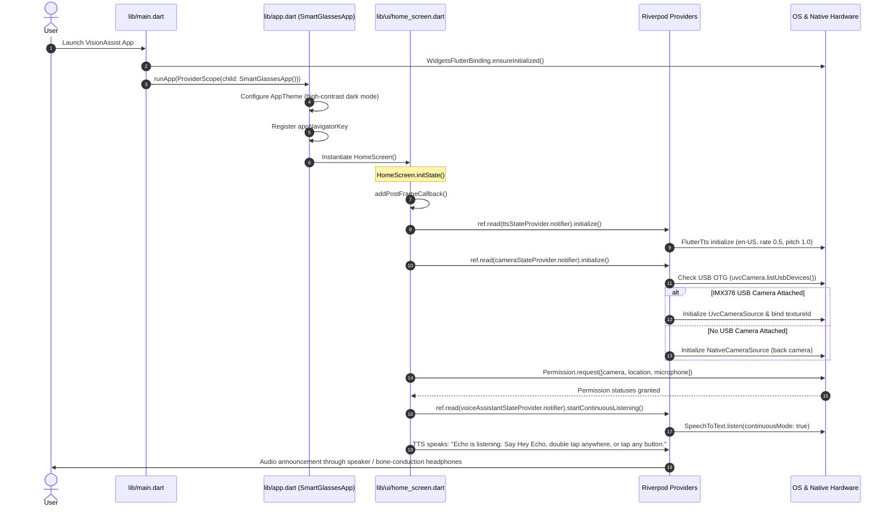

# VisionAssist Smart Glasses — Codebase Structure

## Directory Layout Overview

```
smart_glasses/
├── android/                  # Native Android platform configuration & USB device filters
│   ├── app/src/main/
│   │   ├── AndroidManifest.xml # Permissions (Camera, Audio, Location, USB, BT), USB filter
│   │   └── res/xml/device_filter.xml # USB device filtering for UVC smart glasses
├── assets/                   # Bundled on-device machine learning models and label maps
│   ├── labels/               # Text label maps for ML inference
│   │   ├── currency_labels.txt  # Supported Indian rupee denominations
│   │   └── labelmap.txt         # SSD MobileNet COCO/custom class labels
│   └── models/               # Quantized TensorFlow Lite models
│       ├── efficientdet-lite0.tflite # High accuracy edge detection model
│       └── ssd_mobilenet.tflite      # Low latency object detection model
├── lib/                      # Core Flutter application source code
│   ├── core/                 # Shared constants, accessible theme, and image/audio utilities
│   │   ├── utils/            # Image format conversion and haptic feedback utilities
│   │   ├── constants.dart    # System constants, model thresholds, API configuration
│   │   └── theme.dart        # High-contrast accessible UI styling (WCAG compliant)
│   ├── models/               # Domain data models with natural language serialization
│   │   ├── currency_result.dart   # Banknote denomination entity
│   │   ├── detection_result.dart  # Detected object bounding box & spatial location
│   │   ├── navigation_step.dart   # Turn-by-turn routing instruction step
│   │   └── ocr_result.dart        # Recognized text blocks and stability checker
│   ├── providers/            # Riverpod StateNotifiers, Providers, and StreamProviders
│   │   ├── camera_providers.dart         # Dual-camera state and frame stream providers
│   │   ├── currency_providers.dart       # Banknote classification state provider
│   │   ├── detection_providers.dart      # Object detection state provider
│   │   ├── navigation_providers.dart     # Turn-by-turn navigation state provider
│   │   ├── ocr_providers.dart            # Document reading state provider
│   │   ├── tts_providers.dart            # Text-to-speech audio state provider
│   │   └── voice_assistant_providers.dart# Continuous voice recognition & Gemini agent provider
│   ├── services/             # Hardware drivers, ML inference engines, and external APIs
│   │   ├── camera_service.dart          # Strategy pattern: Phone camera vs IMX378 USB glasses
│   │   ├── currency_service.dart        # Banknote numeric OCR detection service
│   │   ├── gemini_assistant_service.dart# Google Gemini 1.5 Flash multimodal conversational agent
│   │   ├── location_service.dart        # High-accuracy GPS location tracker (Geolocator)
│   │   ├── navigation_service.dart      # OSRM foot engine & Google Directions routing
│   │   ├── object_detection_service.dart# Semantic physical object detector (18 categories)
│   │   ├── ocr_service.dart             # Google ML Kit Latin script text recognizer
│   │   ├── tflite_service.dart          # Low-level TFLite interpreter manager
│   │   ├── tts_service.dart             # FlutterTts engine with priority queue & watchdog
│   │   └── voice_assistant_service.dart # Continuous speech-to-text listener & regex parser
│   ├── ui/                   # High-contrast user interface screens
│   │   ├── widgets/          # Reusable accessible components
│   │   │   ├── accessible_button.dart   # Large >=80dp touch target with haptic feedback
│   │   │   ├── camera_preview.dart      # Dual-mode camera preview (Texture or CameraPreview)
│   │   │   ├── gemini_wave_overlay.dart # Animated glowing Gemini AI voice visualizer
│   │   │   ├── status_banner.dart       # High-contrast status banner with pulse dot
│   │   │   └── voice_assistant_bar.dart # Microphone toggle bar with live transcript
│   │   ├── currency_mode_screen.dart    # Banknote recognition screen
│   │   ├── detect_mode_screen.dart      # Object detection screen with bounding box overlay
│   │   ├── home_screen.dart             # Accessible 4-button dashboard & quick controls
│   │   ├── navigate_mode_screen.dart    # Pedestrian navigation screen with OpenStreetMap
│   │   └── read_mode_screen.dart        # Document / sign OCR reader screen
│   ├── app.dart              # MaterialApp root widget, global appNavigatorKey
│   └── main.dart             # Application entry point with ProviderScope initialization
├── test/                     # Automated unit and widget tests
│   └── widget_test.dart      # Smoke tests verifying core app instantiation
└── pubspec.yaml              # Project manifest, package dependencies, and asset declarations
```

---

## Comprehensive File Inventory (`lib/`)

| File Path | Primary Class / Symbol | Layer | Role & Description |
|---|---|---|---|
| `lib/main.dart` | `main()` | Bootstrap | App entry point; calls `WidgetsFlutterBinding.ensureInitialized()` and starts `runApp(ProviderScope(child: SmartGlassesApp()))`. |
| `lib/app.dart` | `SmartGlassesApp`, `appNavigatorKey` | Application Root | Configures `MaterialApp`, dark high-contrast theme, entry screen (`HomeScreen`), and exposes `appNavigatorKey` for context-free voice navigation. |
| `lib/core/constants.dart` | `AppConstants` | Core | Central repository of configuration constants: asset model paths, API keys, Gemini model names, confidence thresholds, and navigation distance limits. |
| `lib/core/theme.dart` | `AppTheme` | Core | Accessible theme styling tailored for visually impaired users: `#121212` background, `#FFD600` primary yellow, high contrast text, large 32dp icons. |
| `lib/core/utils/audio_feedback.dart` | `AudioFeedback` | Core / Utils | Haptic feedback wrapper providing tactile confirmation for actions (`light`, `medium`, `heavyImpact`, `selectionClick`). |
| `lib/core/utils/image_utils.dart` | `ImageUtils` | Core / Utils | Static helpers for image conversion: `convertYUV420ToRGB`, `resizeImage`, `normalizePixels` (0..1 range for neural nets), and `getCameraImageBytes`. |
| `lib/models/currency_result.dart` | `CurrencyResult` | Domain Models | Banknote denomination entity with denomination name, confidence score, and accessible natural language speech formatter. |
| `lib/models/detection_result.dart` | `DetectionResult` | Domain Models | Bounding box spatial entity with normalized coordinates (`left`, `top`, `width`, `height`), relative horizontal zone (`left`, `ahead`, `right`), and TTS text. |
| `lib/models/navigation_step.dart` | `NavigationStep` | Domain Models | Single step in walking route with instruction text, distance in meters, maneuver type, and coordinates. |
| `lib/models/ocr_result.dart` | `OcrResult`, `TextBlock` | Domain Models | Optical text recognition result with raw text, block coordinates, timestamp, and character-overlap stability checker. |
| `lib/providers/camera_providers.dart` | `cameraServiceProvider`, `cameraStateProvider`, `cameraFrameStreamProvider` | Providers | Riverpod providers managing camera hardware lifecycle, texture binding, active camera source, and throttled camera frame stream. |
| `lib/providers/currency_providers.dart` | `currencyServiceProvider`, `currencyStateProvider` | Providers | Riverpod state notifier managing banknote classification, confidence threshold evaluation, and spoken audio trigger. |
| `lib/providers/detection_providers.dart` | `tfliteServiceProvider`, `objectDetectionServiceProvider`, `detectionStateProvider` | Providers | Riverpod state notifier orchestrating object detection inference, anti-repetition speech debounce timers, and bounding box state. |
| `lib/providers/navigation_providers.dart` | `navigationServiceProvider`, `locationServiceProvider`, `navigationStateProvider` | Providers | Riverpod state notifier managing walking directions, live route polyline points, waypoint progression, and address announcements. |
| `lib/providers/ocr_providers.dart` | `ocrServiceProvider`, `ocrStateProvider` | Providers | Riverpod state notifier managing document scanning, continuous scanning mode toggle, and recognized text state. |
| `lib/providers/tts_providers.dart` | `ttsServiceProvider`, `ttsStateProvider` | Providers | Riverpod state notifier managing text-to-speech engine parameters, active speaking state stream, and interruptive speech calls. |
| `lib/providers/voice_assistant_providers.dart` | `geminiAssistantServiceProvider`, `voiceAssistantServiceProvider`, `voiceAssistantStateProvider`, `voiceCommandStreamProvider` | Providers | Riverpod state notifier coordinating continuous speech recognition, acoustic echo muting, Gemini multimodal queries, and global navigation dispatch. |
| `lib/services/camera_service.dart` | `CameraService`, `CameraSource`, `NativeCameraSource`, `UvcCameraSource` | Services | Strategy pattern camera driver supporting built-in smartphone camera (`camera` package) and Sony IMX378 USB smart glasses (`flutter_ffi_uvc`). |
| `lib/services/currency_service.dart` | `CurrencyService` | Services | Numeric banknote identification service using Google ML Kit Latin TextRecognizer to scan currency numbers (10, 20, 50, 100, 200, 500). |
| `lib/services/gemini_assistant_service.dart` | `GeminiAssistantService`, `GeminiVoiceResponse` | Services | Conversational AI agent using Google Gemini 1.5 Flash for natural intent understanding, multimodal scene descriptions, and phonetic offline fallback. |
| `lib/services/location_service.dart` | `LocationService` | Services | GPS location tracker using `geolocator` with high-accuracy settings and 2-meter distance update threshold. |
| `lib/services/navigation_service.dart` | `NavigationService` | Services | Routing service utilizing OSRM foot engine (primary, keyless) with Google Directions API fallback and OpenStreetMap Nominatim reverse geocoding. |
| `lib/services/object_detection_service.dart` | `ObjectDetectionService` | Services | Physical object detection engine with calibrated 0.28 threshold, abstract tag ban list, and semantic dictionary mapping 18 real-world object types. |
| `lib/services/ocr_service.dart` | `OcrService` | Services | Text recognition service using Google ML Kit Latin script recognizer with vertical block sorting for natural reading order. |
| `lib/services/tflite_service.dart` | `TFLiteService` | Services | Low-level interpreter pool manager for `tflite_flutter`, handling model asset loading, warmup, multi-tensor inference, and resource disposal. |
| `lib/services/tts_service.dart` | `TTSService`, `TTSPriority` | Services | Auditory feedback service with priority queue, automatic speech watchdog timer (prevents frozen speaking state), and completion callbacks. |
| `lib/services/voice_assistant_service.dart` | `VoiceAssistantService`, `VoiceCommand`, `VoiceCommandType` | Services | Continuous microphone listener using `speech_to_text`, wake-word detector ("Hey Echo"), and zero-latency regex intent extractor. |
| `lib/ui/home_screen.dart` | `HomeScreen` | Presentation | Primary accessible portal featuring 4 high-contrast mode buttons, live camera toggle bar, microphone activator, and full-screen double-tap trigger. |
| `lib/ui/currency_mode_screen.dart` | `CurrencyModeScreen` | Presentation | Banknote scanner UI showing live camera feed, giant high-contrast denomination text, and confidence level indicators. |
| `lib/ui/detect_mode_screen.dart` | `DetectModeScreen` | Presentation | Real-time object detection screen with interactive bounding box overlay, 3.5s periodic scanner loop, and tap-to-inspect Gemini trigger. |
| `lib/ui/navigate_mode_screen.dart` | `NavigateModeScreen` | Presentation | Accessible walking navigation screen featuring OpenStreetMap interactive tile layer, destination input, quick destination chips, and turn card. |
| `lib/ui/read_mode_screen.dart` | `ReadModeScreen` | Presentation | OCR document and signboard reader screen with continuous scanning toggle button, full-width text display, and tap-to-scan. |
| `lib/ui/widgets/accessible_button.dart` | `AccessibleButton` | Presentation / Widgets | Standardized accessible button with minimum 80dp touch height, 22sp bold text, large icon, and haptic feedback. |
| `lib/ui/widgets/camera_preview.dart` | `CameraPreviewWidget` | Presentation / Widgets | Universal camera preview renderer supporting native `CameraPreview` or USB UVC hardware `Texture` widget with correct aspect ratios. |
| `lib/ui/widgets/gemini_wave_overlay.dart` | `GeminiWaveOverlay` | Presentation / Widgets | Animated glowing visual wave indicator showing Gemini thinking/listening state, live transcript, and AI responses. |
| `lib/ui/widgets/status_banner.dart` | `StatusBanner` | Presentation / Widgets | Live status banner widget with high-contrast colored borders and pulsing indicator dot. |
| `lib/ui/widgets/voice_assistant_bar.dart` | `VoiceAssistantBar` | Presentation / Widgets | Accessible microphone bar on the home screen with pulsating mic icon, current speech transcript, and voice commands help button. |

---

## Component Dependency Graph & Module Relationships

```mermaid
graph TD
    subgraph UI_Layer ["Presentation Layer (lib/ui)"]
        HS[HomeScreen]
        DMS[DetectModeScreen]
        CMS[CurrencyModeScreen]
        RMS[ReadModeScreen]
        NMS[NavigateModeScreen]
        CPW[CameraPreviewWidget]
        AB[AccessibleButton]
        VAB[VoiceAssistantBar]
        GWO[GeminiWaveOverlay]
        SB[StatusBanner]
    end

    subgraph Provider_Layer ["Riverpod Providers (lib/providers)"]
        CamP[cameraStateProvider / cameraFrameStreamProvider]
        DetP[detectionStateProvider]
        CurP[currencyStateProvider]
        OcrP[ocrStateProvider]
        NavP[navigationStateProvider]
        VAP[voiceAssistantStateProvider]
        TTSP[ttsStateProvider]
    end

    subgraph Service_Layer ["Services & Infrastructure (lib/services)"]
        CamS[CameraService]
        ODS[ObjectDetectionService]
        TFLS[TFLiteService]
        CurS[CurrencyService]
        OcrS[OcrService]
        NavS[NavigationService]
        LocS[LocationService]
        VAS[VoiceAssistantService]
        GAS[GeminiAssistantService]
        TTSS[TTSService]
    end

    subgraph Model_Core ["Domain Models & Core (lib/models, lib/core)"]
        DR[DetectionResult]
        CR[CurrencyResult]
        OR[OcrResult]
        NS[NavigationStep]
        AC[AppConstants]
        AT[AppTheme]
        AF[AudioFeedback]
        IU[ImageUtils]
    end

    %% UI to Providers
    HS --> CamP & VAP & TTSP & NavP
    DMS --> CamP & DetP & TTSP & VAP
    CMS --> CamP & CurP & TTSP
    RMS --> CamP & OcrP & TTSP
    NMS --> NavP & TTSP
    CPW --> CamP
    VAB --> VAP
    GWO --> VAP

    %% UI to Core / Widgets
    HS --> AB & VAB & GWO
    DMS --> CPW & SB
    CMS --> CPW & SB
    RMS --> CPW & SB
    NMS --> AB

    %% Providers to Services
    CamP --> CamS
    DetP --> ODS & TFLS & CamS & TTSP
    CurP --> CurS & TTSP
    OcrP --> OcrS
    NavP --> NavS & LocS & TTSP
    VAP --> VAS & GAS & TTSP & CamP & NavP

    %% Services to Models & Core
    CamS --> IU
    ODS --> DR & AC
    CurS --> CR & AC
    OcrS --> OR & AC
    NavS --> NS & AC
    GAS --> AC
    LocS --> AC
    TTSS --> AC
```



---

## Application Entry Points & Bootstrap Lifecycle

The application lifecycle follows a strictly ordered, asynchronous initialization sequence from native hardware configuration up through accessible visual presentation:



### Key Phases of the Lifecycle:

1. **Flutter Engine Binding (`main.dart`)**:
   `WidgetsFlutterBinding.ensureInitialized()` ensures platform channels are established before any plugin calls are made.

2. **Root Container Mounting (`main.dart` & `app.dart`)**:
   `ProviderScope` wraps the entire widget hierarchy, creating the top-level container for all Riverpod state stores. `SmartGlassesApp` binds the global `appNavigatorKey` to `MaterialApp`, granting the voice subsystem global routing capability.

3. **Post-Frame Asynchronous Warmup (`HomeScreen.initState`)**:
   Initialization logic is deferred until after the first frame via `WidgetsBinding.instance.addPostFrameCallback(...)` to avoid blocking UI frame rendering:
   - **TTS Engine Setup**: `TTSService.initialize()` configures the audio channel, speech rates, and watchdog timeout timers.
   - **Camera Hardware Probing**: `CameraService.initialize()` probes for external UVC USB devices (`flutter_ffi_uvc`), attaching the IMX378 sensor if detected, or opening the native rear camera.
   - **Permission Request & Mic Activation**: Camera, Location, and Microphone permissions are requested simultaneously. Once granted, continuous wake-word listening ("Hey Echo") is immediately armed.
   - **Spoken Welcome Greeting**: The user receives prompt auditory confirmation that the system is ready for hands-free or touch interaction.
